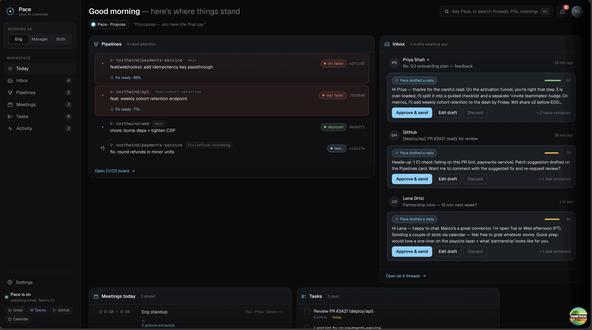

# Pace — Your AI Coworker

> A smart, persona-aware productivity dashboard that acts as an AI coworker for engineers and product managers.

Pace aggregates your inbox, CI/CD pipelines, meetings, and tasks into a single dark-themed dashboard. It drafts emails, suggests pipeline fixes, converts business requirements into product specs, and surfaces action items — all with confidence scores so you stay in control.



---

## Features

### Inbox Intelligence
- Reads incoming emails and drafts context-aware replies with AI confidence scores
- Extracts todos automatically from email threads
- One-click approve, edit, or discard draft actions

### Pipeline Monitoring
- Monitors CI/CD build status across repos and branches
- Surfaces failing stages (lint / test / deploy) at a glance
- Suggests targeted code fixes with inline diffs and confidence ratings

### Plans → Spec
- Takes a business requirement or plan and converts it into a structured product spec
- Outputs goals, screens, APIs, and metrics
- Tracks open questions and spec status (queued → drafting → spec-ready)

### Meeting Summaries
- Shows today's calendar with live/upcoming/past status
- Transcribes meetings and extracts action items with assignees
- Links meeting outcomes back to related tasks and specs

### Unified Task View
- Aggregates tasks from email, Microsoft Teams, and meetings into a single list
- Tracks source, due date, and completion state

### Activity Feed
- Timeline of every AI-assisted action (drafts sent, specs generated, fixes applied)
- Highlights what's awaiting your review

### Customisation Panel
- **Persona** — switch between Engineer, Manager, or Both to reorder and filter cards
- **AI Tone** — Propose / Quiet / Confident / Proactive
- **Look** — dark mode, six accent colours, compact / balanced / spacious density
- **Feature toggles** — show or hide individual cards
- Draggable panel, position is persisted across sessions

### Integrations (Settings Page)
Gmail · Outlook · Microsoft Teams · Slack · GitHub · GitLab · Google Calendar · Jira · Linear · Notion · PagerDuty · Figma


---

## Tech Stack

| Layer | Library / Tool |
|---|---|
| UI | React 19 |
| Routing | TanStack Router (file-based) |
| Styling | Tailwind CSS 4 + custom `pace.css` |
| Icons | Lucide React |
| Build | Vite 8 |
| Language | TypeScript 6 |
| Testing | Vitest + Testing Library |

---

## Getting Started

```bash
npm install
npm run dev
```

Open [http://localhost:3000](http://localhost:3000) in your browser.

---

## Available Scripts

| Command | Description |
|---|---|
| `npm run dev` | Start development server |
| `npm run build` | Production build |
| `npm run preview` | Preview the production build locally |
| `npm run test` | Run unit tests with Vitest |

---

## Project Structure

```
src/
├── App.tsx              # Root app state and layout
├── pace.css             # Dashboard component styles
├── routes/
│   ├── __root.tsx       # Root layout
│   └── index.tsx        # Home route
└── components/
    ├── cards.tsx         # Inbox, Pipeline, Plan, Meeting, Tasks, Activity cards
    ├── slideovers.tsx    # Detail panels (email, pipeline, plan, meeting)
    ├── settings.tsx      # Integrations & settings page
    ├── tweaks-panel.tsx  # Customisation panel + useTweaks hook
    ├── icons.tsx         # SVG icon components
    ├── types.ts          # TypeScript interfaces
    └── data.ts           # Mock data
```

---

## Persona System

Pace adjusts the dashboard layout based on your selected persona:

- **Engineer** — Pipelines card is promoted; spec and meeting cards follow
- **Manager** — Plans → Spec and Meetings lead; pipelines are secondary
- **Both** — All cards shown in balanced order

Switch personas using the sidebar selector or the Tweaks panel.
